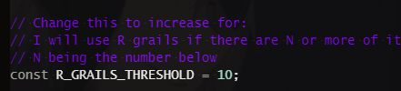

#  Albino Sol
I was playing Metro Exodus, okay? Threesome btw

Auto enhances le rotting fodder storage.

## What's New
 - 20-08-2020

### Fixed
- Now excludes weapons that are equipped, locked, or *aroused* :waitWhat:
- Optimised Sol Notification to display relevant text properly

 - 12-08-2020

### Added
- Sol Notifications to track what AS has been doing

### Changed
- Optimised API calls by only update method, instead of get-and-update method.

### Fixed
- R weapons with +1s being included as fodders

### Removed
- Browser alerts (replaced by Sol Notifications)

## Activation
- Toggle Hotkey: `Shift` + `E`
- User must be in my page/equipment page AND idle first!

## Conditions
> ### Legend
> - SRG = SR Grail
> - RG = R Grail

- If there are >= 10 RG and there are SRG/SR, use it as fodder to SRG / SR
- If there < 3/6/10 (req. for RG/SR/SRG) R and there are SRG/SR, use RG as fodder to SRG / SR
- If none of the above is met, use R with no +1 as fodder being top priority from left: SRG, SR, RG
- SRG = SL5
- SR = SL4
- RG = SL4

First condition can be modified by:
> 

## Demo

## Installation
- Battle-tested in [Google Chrome](https://www.google.com/chrome/index.html) and [Microsoft Edge (Chromium)](https://www.microsoft.com/en-us/edge)
- Requires [TamperMonkey](https://www.tampermonkey.net/) extension installed
- Download: Right in my asshole

## [Copyright](../README.md#Copyright)
