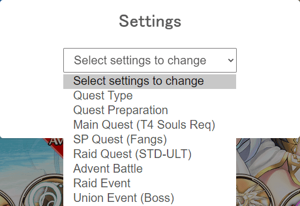

#  Infant Sol
Inspired by Crossak's Sol Battler. No, not the one modified by gbros and his boyfriend.

Best used with [Sol's Black Cock](../bbc/README.md)!

## What's New
 - 13-09-2020

### Changed
- Script's initialisation changed to 5 seconds after the game has loaded

### Fixed
- Trying to call game API while it's not yet loaded
- Error function patching being bypassed

 - 07-09-2020

### Added
- Raid Quest Leeching Mode
- Starting Director now displays the current mode on Sol Notification

### Changed
- Script's initialisation now starts 10 seconds after the game has loaded
- Improved sleep implementation to prevent invoking the last to-be-called function(s)
- (UE / Raid Leech) `Still Attacking` checker function changed interval from 2 minutes to 5 minutes
- Make error notifications permanently visible

### Fixed
- (UE / Raid Leech) Auto-reload function crashes the game

## ⚠️ Preface
- **Director** = the script itself
- **Hotkeys**:
  - `CTRL` + `SHIFT` + `S` - Show settings panel
  - `SHIFT` + `D` - Show current settings
  - `SHIFT` + `S` - Start/stop Director with current mode
- Settings are saved
- Before starting Director, the user must set their preferred party, on idle state (no battles ongoing), and has already cleared the mode's battle(s) at least once
  - The user can stop Director anytime
  - **FOR EVENTS**: The user must go to the event's top page before starting Director
- Default settings:
```js
({
    ue: {
        difficulty: 'Expert',
        boss: 'seraph'
    },
    main: {
      maxRebattles: 1,
      quests: [ MAIN_QUESTS.ROTTEN, MAIN_QUESTS.SHADOW ]
    },
    daily: {
        maxRebattles: 1,
        elements: [ DAILY_QUESTS.LIGHT ]
    },
    raid: {
      difficulties: RAID_QUESTS.FIRE.concat(RAID_QUESTS.LIGHT)
    },
    raidLeech: {
      quests: [ 'fire-grd', 'light-cat' ],
      minHP: 25,
      maxHP: 50,
      minTime: 20,
      maxTime: 59,
      unionOnly: true,
      fifoAll: true
    },
    advent: {
        maxRebattles: 1,
        difficulty: ADVENT_QUESTS.EXPERT
    },
    raidEvent: {
        maxMaterials: 220,
        skip: [ RAID_EVENT_QUESTS.RAGNAROK ]
    },

    seedThreshold: 300,
    heThreshold: 500,
    element: ELEMENTS.LIGHT,
    medeaIsShit: true,
    shareRaid: {
        all: false,
        friends: false,
        union: true
    },

    enabled: false,
    mode: 'DAILY' // SP Quest
})
```

## Configuring with Settings Panel
Reminder: Hotkey is `CTRL` + `SHIFT` + `S`

<center></center>

### Auto Modes
Described as `Quest Type` in settings panel.

<center></center>

- `Main Quest (T4 Souls Req)`: Starts battle in the check list. The max re-battles specified is **per quest** in the list
- `SP Quest (Fangs)`: Starts battle from the first element set in the list. The max re-battles specified is **per element** in the list
- `Raid Quest`: Starts battle from STD-ULT all elements
- `Raid Quest Leeching`: Joins a battle that has less than 18 participants and complies to user's conditions in settings panel
- `Advent Battle`: Starts battle with specified difficulty (default: expert)
- `Raid Event`: Starts battle from STD and stops at the max materials specified, and then jumps to higher difficulties and consume their tokens
- `Labyrint Exploration`: Starts battle from Ultimate difficulty. Will re-take the quest if the user's team died.
- `Union Event`: Joins a battle that has less than 8 participants, and more than or is equal to 50% HP

### Quest Preparation

<center></center>

- `Preferred element` - For eidolon support picking (Priority: Hundo->Guardian->Fallback to first support)

<center></center>

- `Half Elixir Threshold` - Dictates Director to stop using HE and use regen'd AP once the remaining count reaches the specified threshold
- `Seed Threshold` - Dictates Director to stop using seeds and use regen'd BP once the remaining count reaches the specified threshold
- `Medea is Shit` - If enabled, Director prefers AB on easy contents (being beginner, standard, expert difficulties)
- `Raid Sharing` - Self-explanatory

### Main Quest

<center></center>

- `Max Re-battles Per Quest` - Self-explanatory
- `Quests to do` - Dictates Director to do the [quests](https://kamihime-project.fandom.com/wiki/Souls#S_Class) that drop the T4 required materials in the following checked realms

### SP Quest (Fangs)
To set the re-battle to infinite, set **re-battles to `0`** and there should be **only `one element` in elements to farm**.

<center></center>

- `Max Re-battles Per Element` - Self-explanatory
- `Elements to Farm in Order` - Self-explanatory

### Raid Quest (STD-ULT)
Dictates Director to do the following checked quests:

<center></center>

### Raid Quest Leeching
Dictates Director to check the following conditions before joining a qualified raid:

<center></center>

- `Union Only` - Self-explanatory
- `FIFO + All Raids` - Ignores `Quests to Leech / Priority List` and will seek the oldest raid
- `Time Range (by minutes)` - Self-explanatory. Min: 10, Max: 59
- `HP% Range` - Self-explanator. Min: 10, Max: 100
- `Quests to Leech / Priority List` - Only seek the quests listed by the user. Leftmost being the top priority

### Advent Battle
To set the re-battle to infinite, set **re-battles to `0`**.

<center>
    
    
</center>

- `Difficulty` - Self-explanatory
- `Max Re-battles` - Self-explanatory

### Raid Event

<center></center>

- `Max Materials (to farm on STD)` - Director will jump to higher difficulty once the materials to farm on STD is reached
- `Difficulties to Farm` - Self-explanatory

### Union Event
This mode has built-in functionality with 2 minutes interval: reloads the game and re-joins the current battle whenever it has detected
that the user is stuck in a certain turn.

This has a caveat that it will reload anyway even if the user is still casting abilities on non-0 turns.
Using this script with BBC will likely solve this case.

<center>
    
    
</center>

- `Difficulty` - Self-explanatory
- `Boss` - Self-explanatory

## Demo

## Installation
- Battle-tested in [Google Chrome](https://www.google.com/chrome/index.html) and [Microsoft Edge (Chromium)](https://www.microsoft.com/en-us/edge)
- Requires [TamperMonkey](https://www.tampermonkey.net/) extension installed
- Download: Right in my asshole

## [Copyright](../README.md#Copyright)
